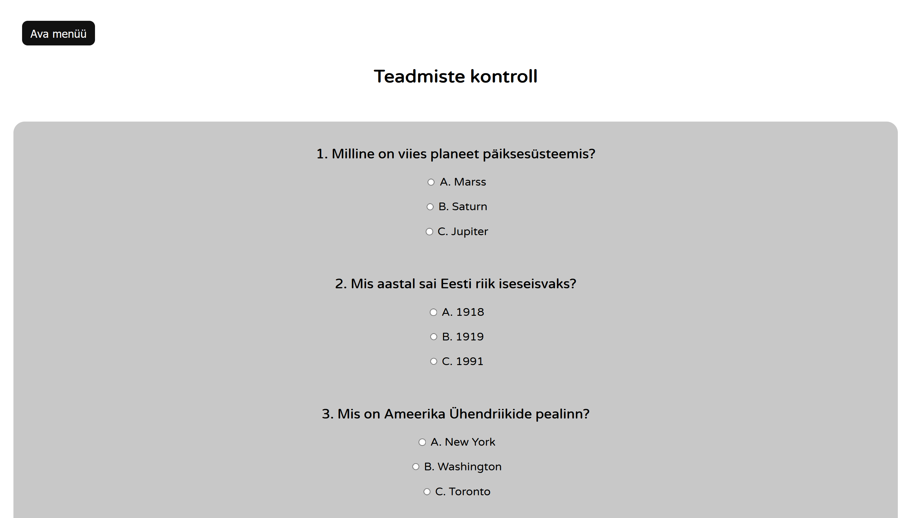
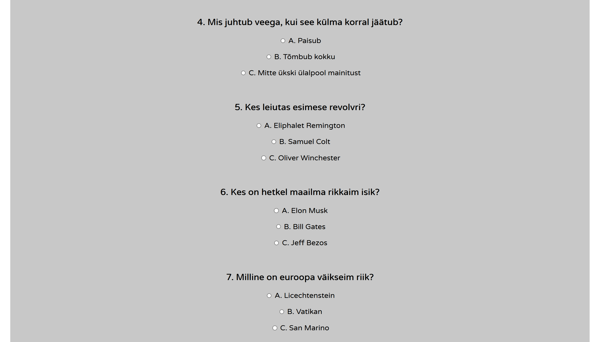
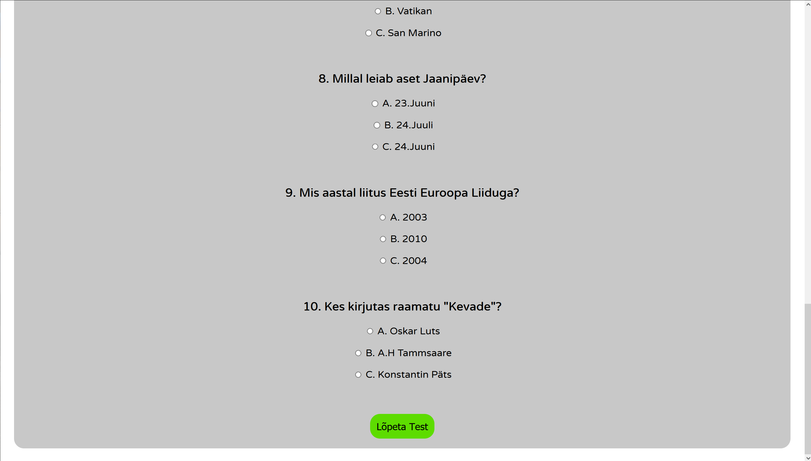
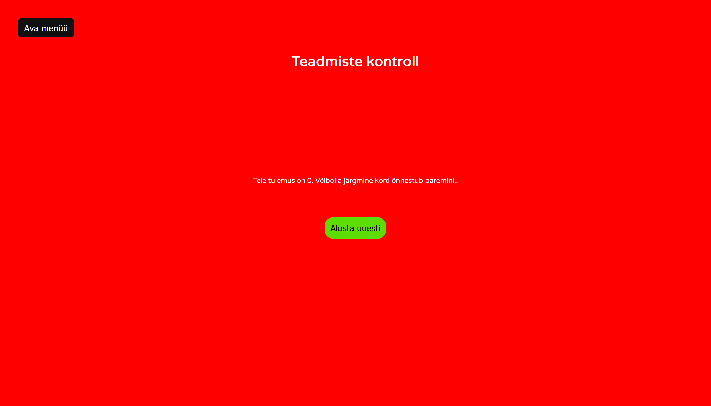
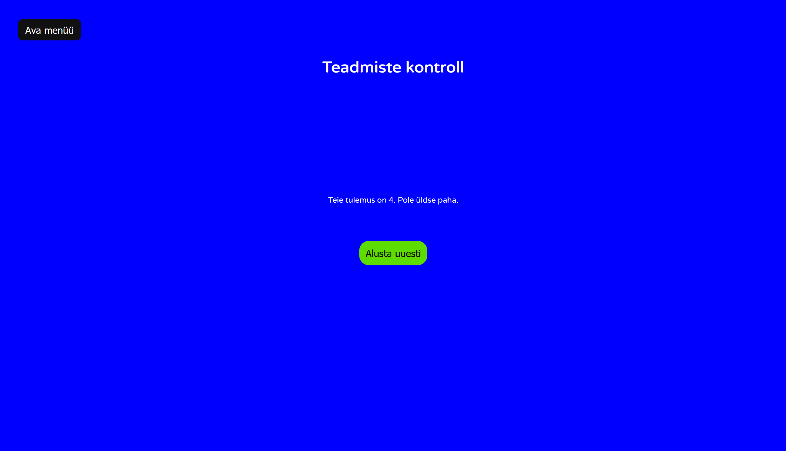
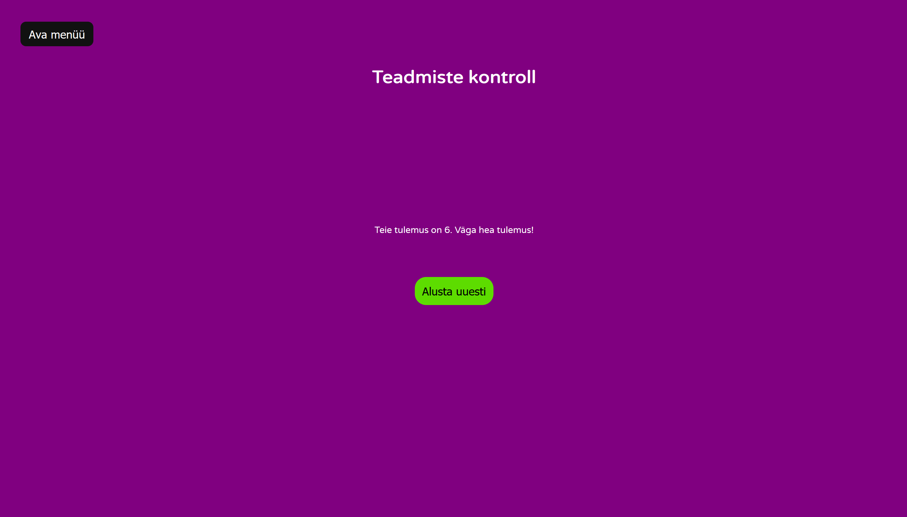
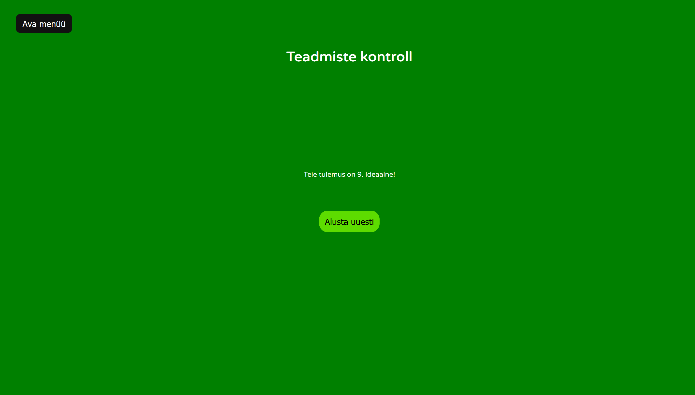
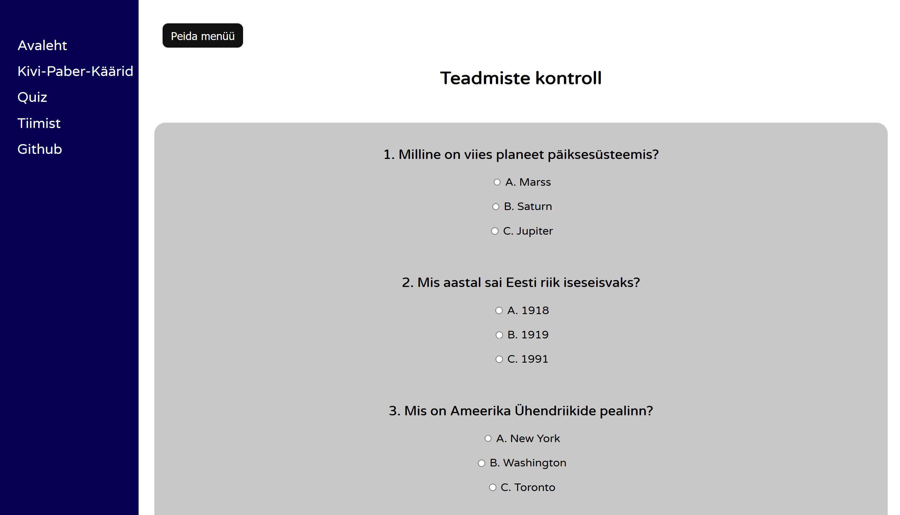

# iseseisev-projekt

 [http://www.tlu.ee/~hm4543/Projekt/index.html](http://www.tlu.ee/~hm4543/Projekt/index.html)

# Veebilehe raamistik, kus on sees kaks mängu Kivi-Paber-Käärid ja Quiz

## Autorid:
### Hans-Märten Liiu
#### Kivipaberkäärid(JS täielikult ise kirjutatud) ja tiimileht
##
### Jan-Erik Läänesaar
#### Quiz ja Menüü

##
Rakenduse funktsionaalne kirjeldus:

1. Avalehel on kirjas tiimi nimi, ning taustal mängib ilus merevaade.
1. Igalt leheküljelt on võimalik menüü kaudu liikuda teistele lehekülgedele.
1. Menüüd saab nupuga avada ja sulgeda.
1. Menüüd avamisel liigub terve lehe sisu paremale, ning kinni pannes uuesti tagasi.
1. On ka olemas tiimileht, kus on lühitutvustus ja pilt meist endist.
1. Veebilehe raamistik on mõeldud meelelahutuslikul eesmärgil, seega veebileht sisaldab Kivi-Paber-Käärid mängu ja lihtsat teadmiste kontrolli.
1. Kivi-Paber-Käärid mäng loeb scoori(seal hulgas ka viike).
1. Kivi-Paber-Käärid käigu tegemine on interaktiivne.
1. Käigule vastavalt uuendatakse tulemust, mis resetib, kui leht refreshida.
1. Käigu võitmise/kaotuse/viigi kohaselt uuendatakse ka parasjagu välja käidud nii arvuti kui ka kasutaja poolt käik värviliselt.
1. Võitja käsi on roheline, kaotaja roosa ja viik on sinine.
1. Quizis on kümme küsimust, mille lõpetamisel kuvatakse kasutajale ta skoor.
1. Quizi lõppedes peidetakse küsimustik ära.
1. Quizi lõpuekraanil muutub tasutavärv vastavalt kasutaja skoorile ning kuvatakse iga skooritaseme kohta vastav sõnum.
1. Quizi lõpuekraanil tekib nupuke, mida vajutades leht värskendub ning on võimalik küsimustikku uuesti sooritada.

## Kivi paber käärid kuvatõmmised

  

## Quizi kuvatõmmised

