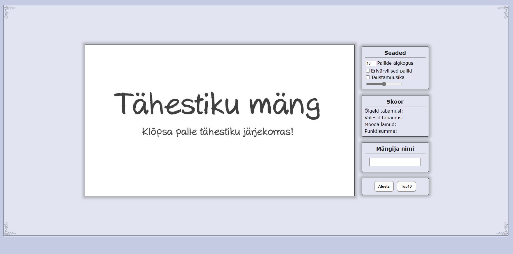
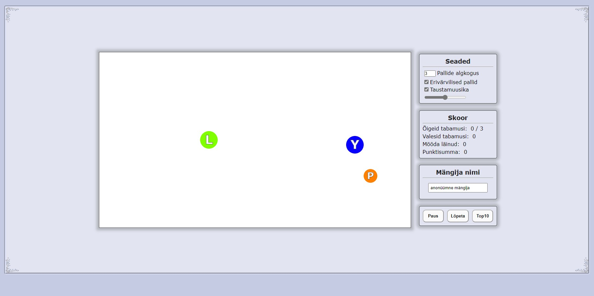
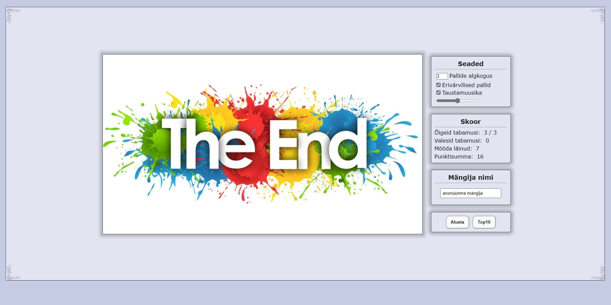
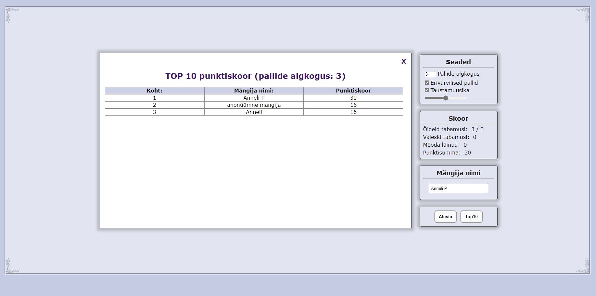
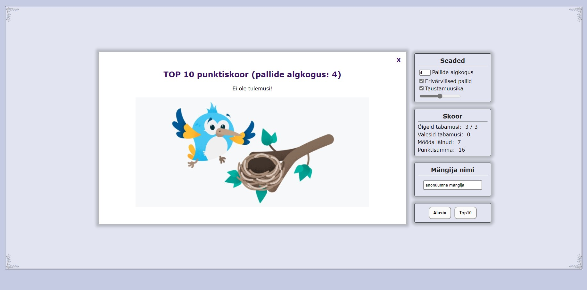
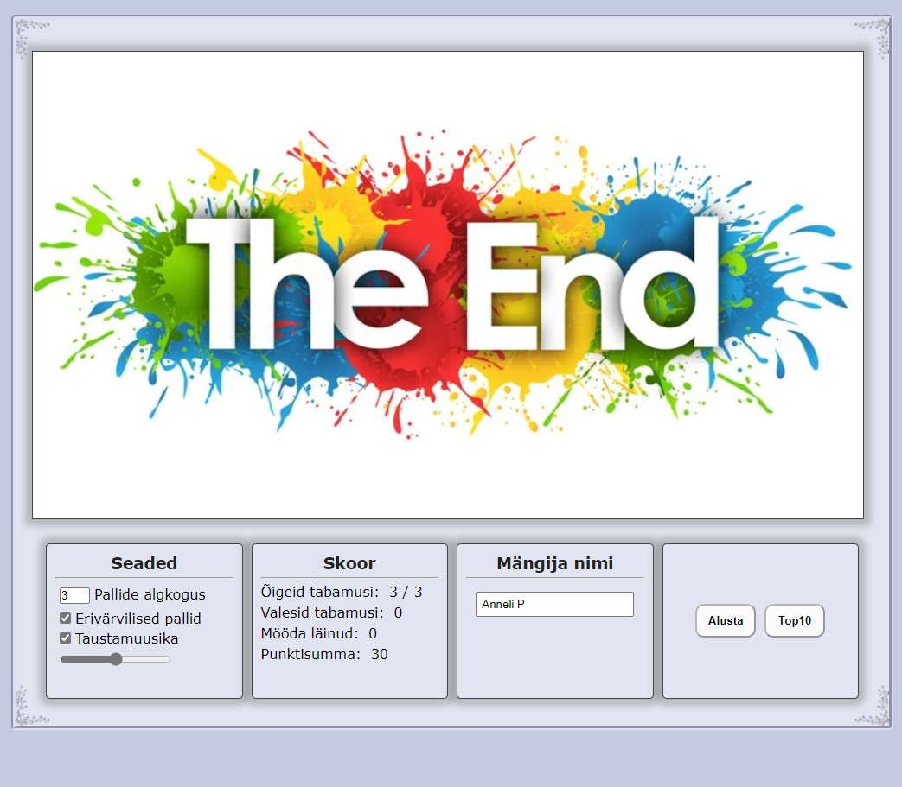

# Iseseisev töö  - Tähestiku mäng
Kella veebileht: http://www.tlu.ee/~annelip8/Mang/game.html    
Autor: Anneli Põldaru  
  
Võtsin põhjana kasutusse: http://greeny.cs.tlu.ee/~rinde/2021/veeb_ja_meedia/veeb_ja_meedia_valik/tund_13/game.html  
Tegin mõningad muudatused. Täiendasin nii kujunduse osa, kui lisasin uusi funktsionaalsusi. 
  
## Funktsionaalsused:
### Seadistus:
* Saab määrata pallide algkoguse 3-32 tükki (et ei oleks liiga lihtne ja samas ei ületaks tähestiku massiivis olevate tähtede arvu).  
* Valida, kas mängida eri- või ühevärviliste pallikestega. Tehtud valikut saab ka keset mängu muuta!  
* Valida, kas kuulata taustamuusikat või mitte. Tehtud valikut saab ka keset mängu muuta.   
* Määrata liuguriga taustamuusika helitugevust.  

### Punktiskoor ja TOP 10:
* Kuvatakse ka tabamuste skoori (õigeid, valesid ja täitsa mööda läinud tabamuste arvu). See info uueneb jooksvalt.  
* Mängu ajal arvutatakse kokku punktiskoor: õige tabamus annab +10 punkti, vale tabamus -3 punkti ja mööda läinud tabamus -2 punkti.
* Mängijal on võimalus lisada oma nimi. Kui aga nime väli jääb tühjaks, registreeritakse mängijaks "anonüümne mängija".
* Punktiskoor, pallide kogus ja nimi salvestatakse local Storagesse.
* `Top10` nupul klikates kuvatakse ka top10 tulemusi, mis on tehtud just selle pallide arvuga, mis on hetkel ka `Pallide algkogus` väljal kirjas.

### Taustal toimuv:
* Kõik mängus kasutusel olevad algväärtused nullitakse iga uue mängu alguses.  
* Mängu saab pausile panna. Juhul, kui mängija kuulas parasjagu ka taustamuusikat siis pannakse ka muusika pausile. Ning pausi lõpetamisel jätkavad pallid oma teekonda ning muusika (kui taustamuusika on parasjagu lubatud) jätkab mängimist. Pausi ajal ei kuulata kanvaa peal tehtavaid klikke.  
* Mängu ajal on näha muidu peidus olev `Lõpeta` nupp. Mängija saab vajadusel mängu katkestada.  
* Mängu loomuliku lõpu korral või katkestamise tulemusena läheb `Lõpeta` nupp taaskord peitu.  
* Mängjale on (kuniks ta ei ole uut mängu alustanud) näha tabamuste skoorid. Ja kanvaa peale on siis "joonistatud" mängu lõppu sümboliseeriv pilt.  
  
## Kuvatõmmised
Enne alustamist:  
  
Mängu ajal:  
  
Mängu lõpus:  
  
Top10:  
  
Top10, kui tulemusi ei ole:  
   
Veidi kitsama läpaka ekraanil:  
  
