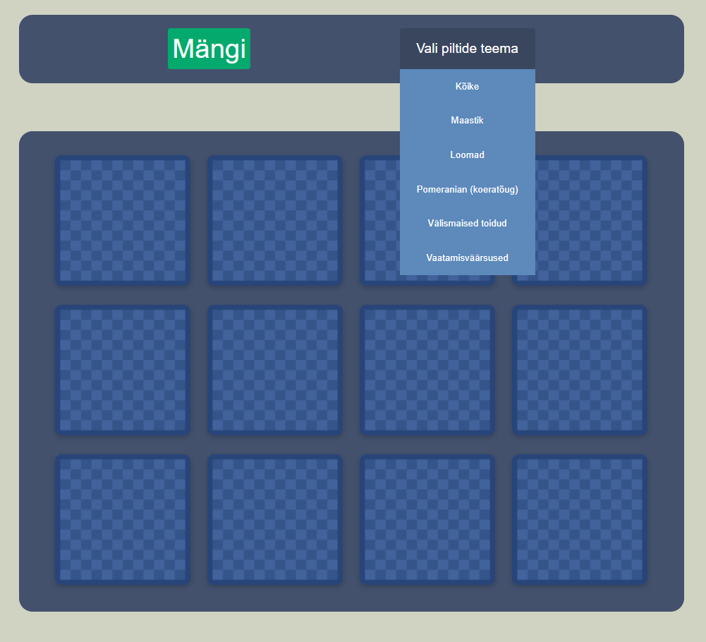
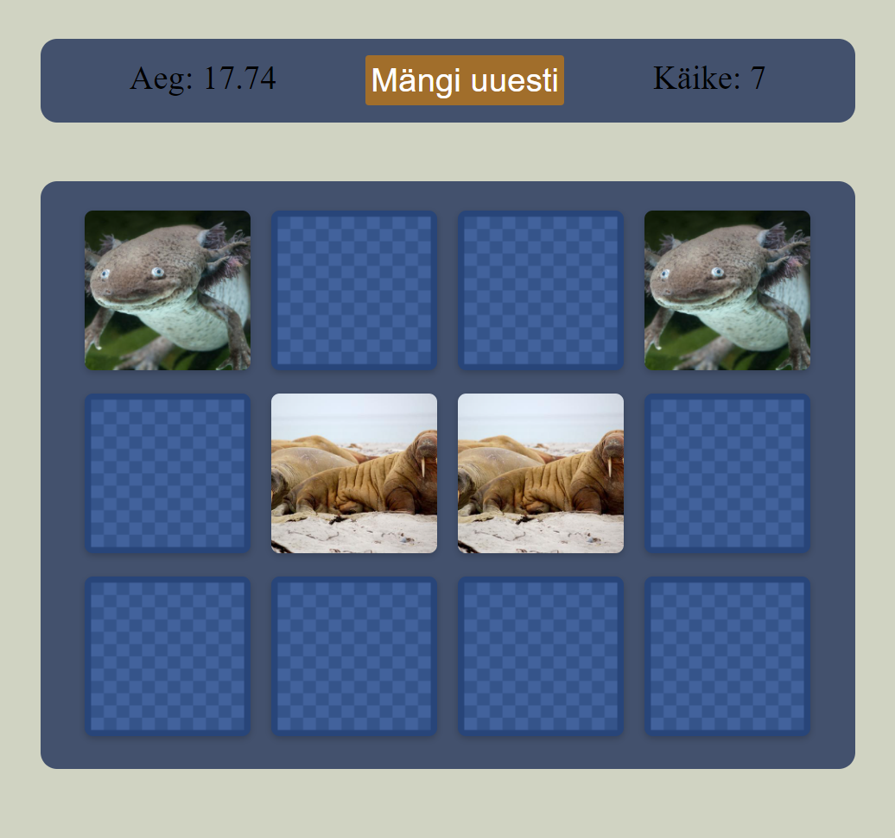
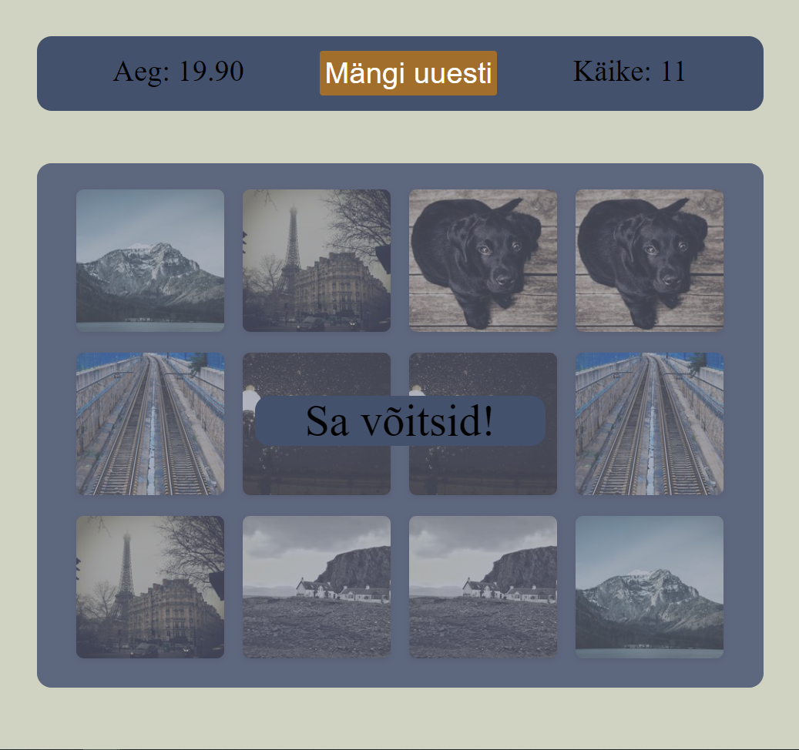

# Iseseisev projekt - mälumäng (memory game)

## Autorid ja veebileht

Autorid: Harli Kodasma, Ekke Alar Toomingas
Rakendus on kättesaadav siin: http://www.tlu.ee/~harli17/eesrakendused/projekt/

## Rakendusest ja selle funktsionaalsusest

Tegu on mälumänguga ehk memory game, kus on ette antud 3x4 ruudustik tagurpidi pööratud pilte. Korraga saab avada kaks pilti. Avades kaks samasugust pilti jäävad need avatuks, erinevate piltide avamisel pööratakse need uuesti tagurpidi. Mäng lõppeb, kui kõik paarid on leitud ja ümber pööratud. Funktsionaalsus:
* Igal korral on piltide asetus täielikult randomly generated
* Enne mängu alustamist on võimalik valida 6 erineva teema vahel, milliste piltidega mängima hakkad
* Ülalmainitud menüü on kokku ehitatud tutoriali ja omaloomingu põhjal. Tegu pole tavalise rippmenüüga vaid hiirega üle hoverides avaneb see ilma klikita, valikule klikkides kaob menüü eest ära (see osa on omalooming) ning viimati tehtud valik muutub ka menüü "pealkirjaks" (see on samuti omalooming)
* Vajutades "Mängi" nupule hakkab jooksma aeg, mis jääb seisma mängu lõppedes
* Iga pildipaari avamine läheb arvesse ühe käiguna ning käikude arvu näidatakse mängu ajal
* Mängu taaskäivitamiseks on olemas nupp nii mängu ajal kui ka lõpus
* Iga pildile vajutusega kõlab heli
* Ebasobiva paari tagasi ümberpööramisel kõlab heli
* Mängu võitmisel kuvatakse sellekohane teade ning kõlab heli

Märkus: ajal, mil ebasobivat paari pilte pööratakse ümber, ei saa lehel midagi vajutada, kaasa arvatud "Mängi uuesti" nuppu. Seda põhjusel, et vältida pilte kiiresti "spammides" rohkem kui 2 pildi korraga avanemine. Selle takistamiseks on kirjutatud JSis tingimus, et kui 2 pilti juba on lahti, siis leht freezitakse seniks kuni mittesobiv paar on tagasi pööratud.

## Tööjaotus

Harli tegi JSis kogu pics.forEach tsükli ning enamus HTMList. Ekke tegi kogu CSSi. Ülejäänud JSi ning osa HTMList tegime koostööna Visual Studio Code Live Share abil. Mõlemad otsisime ja valmistasime ette pooled erinevatest piltidest, mida mäng kasutab.

## Ekraanipildid rakendusest

### Avavaade enne mängu alustamist, kus on lahti tehtud pildi teema valikumenüü

### Keset mängu tehtud pilt, kus kaks pildipaari on leitud ning teemaks on valitud loomad

### Vaade pärast mängu võitmist, kus teemaks on valitud "kõike" ehk jäetud default valik

