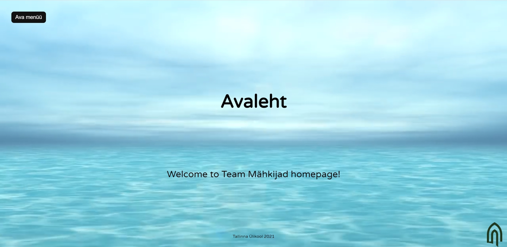
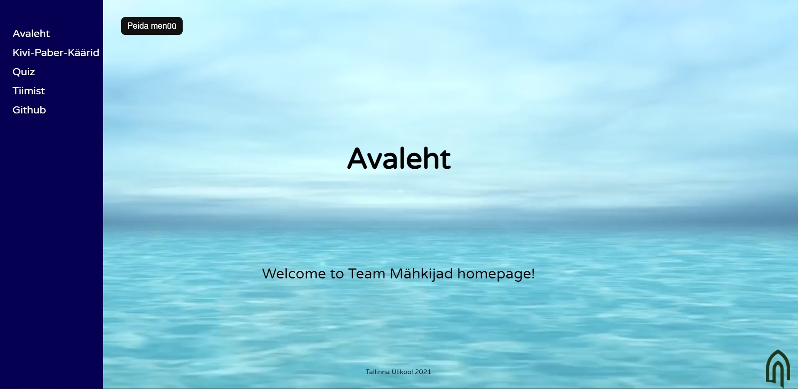
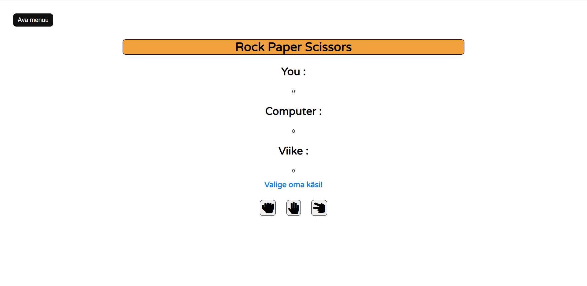
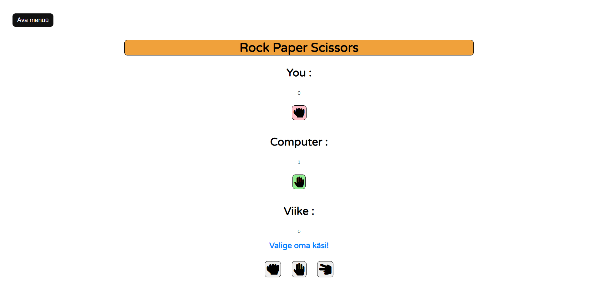
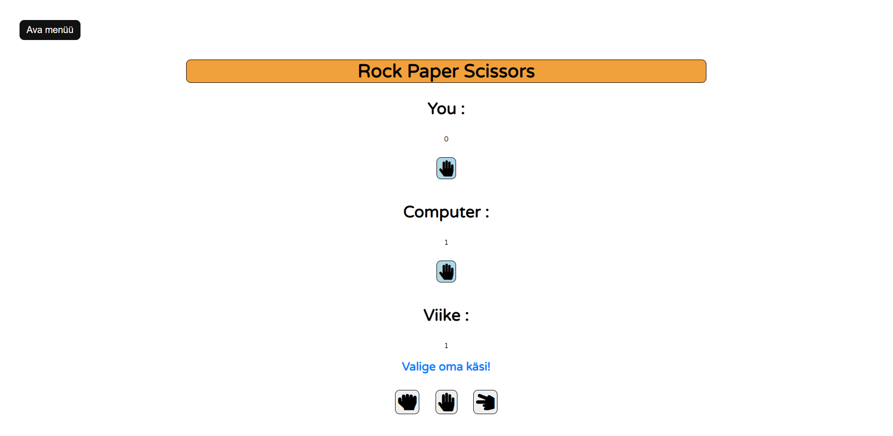
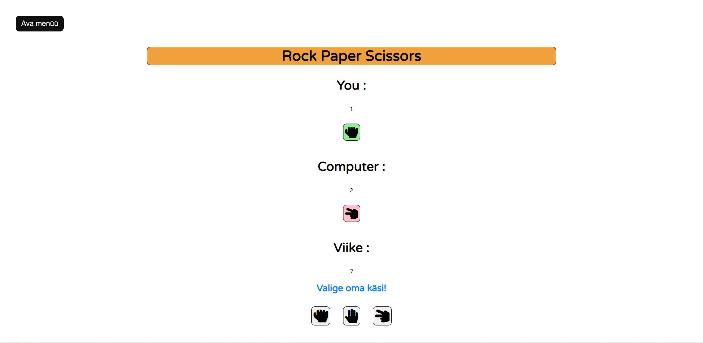
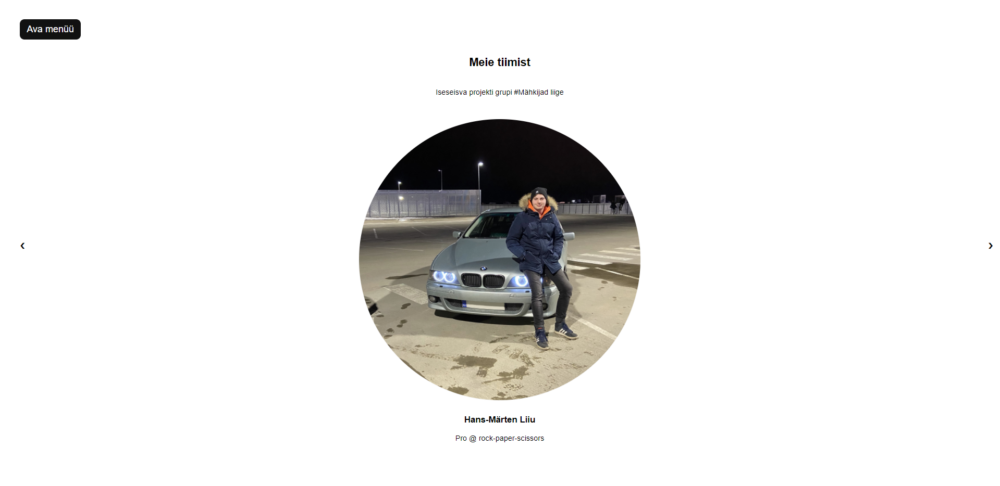

# iseseisev-projekt

 [http://www.tlu.ee/~hm4543/Projekt/index.html](http://www.tlu.ee/~hm4543/Projekt/index.html)

# Veebilehe raamistik, kus on sees kaks mängu Kivi-Paber-Käärid ja Quiz

## Autorid:
### Hans-Märten Liiu
#### Avaleht ja kivipaberkäärid(JS täielikult ise kirjutatud) ja tiimileht
### Jan-Erik Läänesaar
#### Quiz ja Menüü

README.md fail sisaldab:
1. suurelt rakenduse nime;
1. autorite nimesid;
1. rakenduse funktsionaalsuse kirjeldust;
1. ekraanitõmmist rakendusest.

Rakenduse funktsionaalne kirjeldus:
1. Avalehel on kirjas tiimi nimi, ning taustal mängib ilus merevaade
1. Igalt leheküljelt on võimalik menüü kaudu liikuda teistele lehekülgedele
1. Menüüd saab nupuga avada ja sulgeda
1. Veebilehe raamistik on mõeldud meelelahutuslikul eesmärgil, seega veebileht sisaldab Kivi-Paber-Käärid mängu.
1. Kivi-Paber-Käärid mäng loeb scoori(seal hulgas ka viike).
1. Kivi-Paber-Käärid käigu tegemine on interaktiivne.
1. Käigule vastavalt uuendatakse tulemust, mis resetib, kui leht refreshida.
1. Käigu võitmise/kaotuse/viigi kohaselt uuendatakse ka parasjagu välja käidud nii arvuti kui ka kasutaja poolt käik värviliselt.
1. võitja käsi on roheline, kaotaja roosa ja viik on sinine.
1. Leheküljel on ka olemas tiimileht, kus on lühitutvustus ja pilt meist endist.

## Kuvatõmmised

