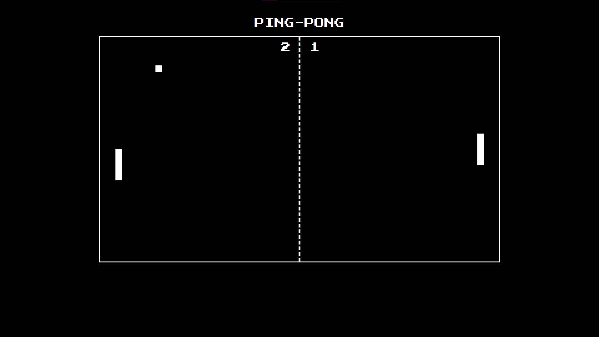
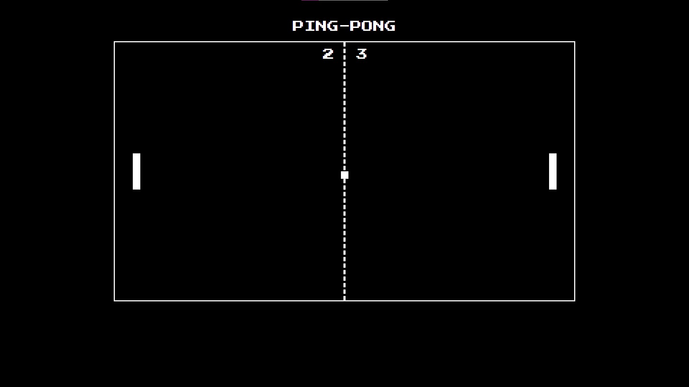

# PING-PONG 2-mängija mäng

Autor: Oliver Labi

Klassikaline PING-PONG retro stiilis mäng, mida saab ainult kahekesi mängida. 90% koodist on minu tehtud. Kasutasin Google abi, et teha korda kahe mängija liikumine ja võtsin palli laba põrkamise valemi veebilehelt.

## Funktsionaalsus

* Kahe mängija juhtimine
* Liikumine käib nuppudega "W", "S", "ArrowUp", "ArrowDown"
* Ülesanne hoida palli keskväljakul ning mitte lasta pallil mängija labast mööduda
* Möödudes palli labast, saab teine mängija punkti
* Mäng käib vaikimisi 3 punkti peale
* Maksimaalseid punkte saab muuta pingpong.js koodis (graafiline liides loomata)
* Pallikiiruse väärtuseid saab muuta pingpong.js koodis (graafiline liides loomata)

## Teadaolev viga

* Lehekülje footeris on NES.css hiire pointer

## Kasutatud allikad / lisateekid

* https://nostalgic-css.github.io/NES.css/ - font "Press Start 2P"
* https://medium.com/@dovern42/handling-multiple-key-presses-at-once-in-vanilla-javascript-for-game-controllers-6dcacae931b7 - Mitme mängija liikumine
* http://fabricjs.com/ - Lisateek inimlikumaks canvase joonistamiseks
* https://developer.mozilla.org/en-US/docs/Games/Techniques/2D_collision_detection - Labalt palli põrkamise valem

## Pildid

