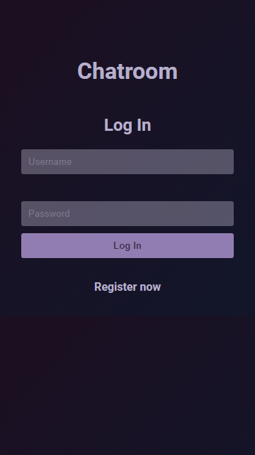

# Chatroom

### Autor: Markus Tammeoja

### Eesmärk
Eesmärk oli koostada anonüümse chatroomi, kus kasutajatel on võimalik üksteisega jutu ajada. Soov oli paigutada seda lin2 võrku, kus pole tunnelit vaja.

Selle lahenduseks võib kasutada Google Firebase, mis lubab rakenduse ehitamist mõnel määral ilma serverita - jututuba on hea näide selle rakendamises.

### Live link

- [Chatroom](http://www.tlu.ee/~dr1nky/chatroom/)

### Kasutatud õpetus
- [Firebase setup](https://firebase.google.com/docs/web/setup)
- [Firebase Auth API](https://firebase.google.com/docs/auth/web/start)
- [YouTube - sisselogimisloogika Firebase kaudu](https://www.youtube.com/watch?v=6g1j_jRMHGA)
- [Stackoverflow - displayName](https://stackoverflow.com/questions/40389946/how-do-i-set-the-displayname-of-firebase-user/40429080)

### Funktsionaalsus

- Kasutaja logimine läbi Firebase
- Kasutaja registreerimine läbi Firebase
- Sõnumite saatmine
- Sõnumite kustutamine
- Emoticonide lisamine chatti

### Pildid

